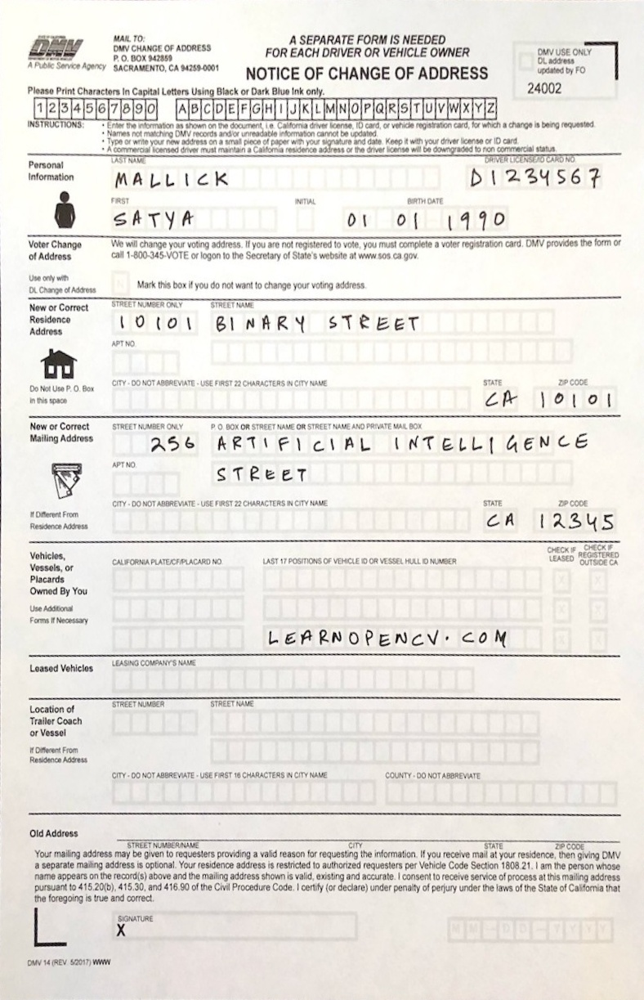

# Document Scanning

## Document_scanning

This notebook will teach you about:
* Morphology
* Canny Edge Detection
* Contours
* Corner Detection using Douglas-Peucker algorithm
* Homography
* Perspective Transform

You will learn to perform document scanning using the above techniques.

### Input

### Output:

