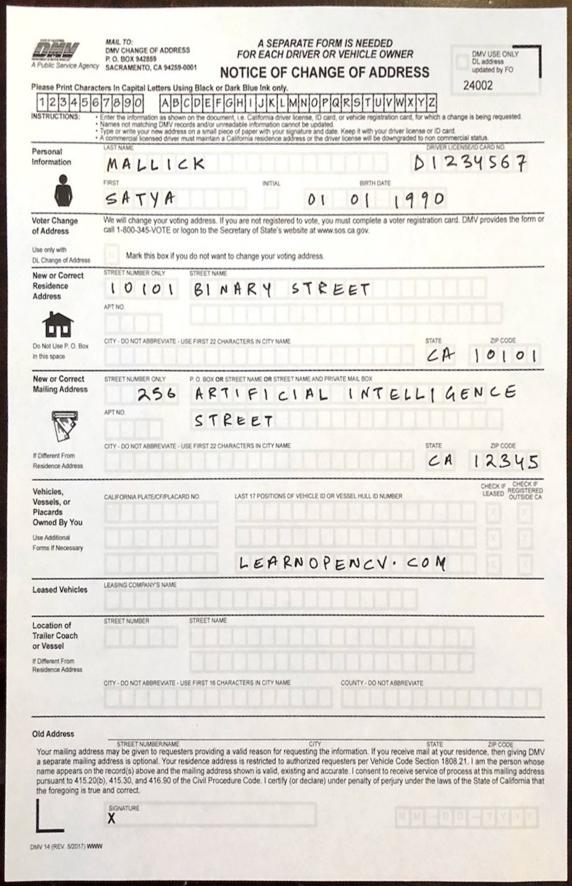

# Document allignment

## Document_alignment_with reference.ipynb

This notebook will teach you about:
* ORB
* Discriptor Matcher
* Perspective Transform
* Homography
* Perspective Transform

You will learn to perform document alignment using the above techniques.

### Outputs:

## Document_alignment

This notebook will teach you about:
* Morphology
* Canny Edge Detection
* Contours
* Corner Detection using Douglas-Peucker algorithm
* Homography
* Perspective Transform

You will learn to perform document alignment using the above techniques.

### Output:

